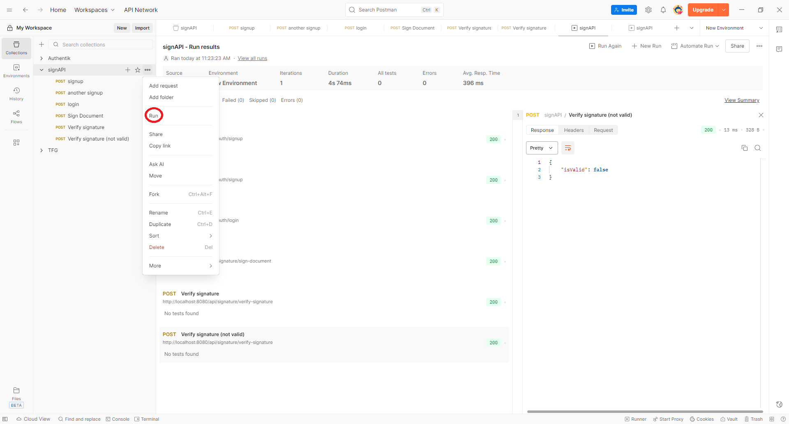

# sing-api
Proyecto con una APIREST para la firma de documentos.


## Requisitos del Proyecto

Para ejecutar y desarrollar esta API es necesario contar con el siguiente entorno:

| Componente           | Requerido | Instalación externa | Descripción                                                   |
| -------------------- | :-------: | :-----------------: | ------------------------------------------------------------- |
| **Java**             |     21    |         ✅ Sí        | Debe estar instalado y configurado en el sistema              |
| **Maven Wrapper**    |  Incluido |         ❌ No        | Permite ejecutar Maven sin instalarlo                         |
| **Base de datos H2** |  Incluida |         ❌ No        | Base de datos en memoria que no requiere configuración previa |

### Notas importantes

+ No es necesario instalar Apache Maven manualmente.
El proyecto incluye:
    + mvnw (Linux/macos)
    + mvnw.cmd (Windows)
    + .mvn/wrapper/maven-wrapper.properties. Esto garantiza que siempre se utilice la versión configurada de Maven (3.9.11).
+ La base de datos H2 se crea automáticamente en memoria al iniciar la aplicación, por lo que no requiere instalación ni configuración adicional.
+ Tener en cuenta que al reinicar la app, se pierden todos los datos de la base de datos.

## Comandos para instalar y ejecutar la app

### Ejecutar Maven Wrapper sin tener Maven instalado:

| Sistema Operativo | Comando                  |
| ----------------- | ------------------------ |
| **Windows**       | `mvnw.cmd clean install` |
| **Linux / macOS** | `./mvnw clean install`   |

### Para ejecutar la aplicación después de compilar:

| Sistema Operativo | Comando                    |
| ----------------- | -------------------------- |
| **Windows**       | `mvnw.cmd spring-boot:run` |
| **Linux / macOS** | `./mvnw spring-boot:run`   |


## Api de autenticación

La API proporciona endpoints para registrar usuarios y autenticarlos mediante JSON Web Tokens (JWT).

### SignUp

POST /api/auth/signup

Crea un nuevo usuario en la base de datos, genera su par de claves y devuelve su identificador, username y JWT.

#### Body de la request (JSON):
````
{
  "username": "usuarioEjemplo",
  "password": "secreto123"
}
````
#### validaciones del dto:

| Campo      | Requerido | Restricciones                 |
| ---------- | :-------: | ----------------------------- |
| `username` |     ✅     | No vacío, máx. 50 caracteres  |
| `password` |     ✅     | No vacío, mínimo 4 caracteres |

#### DTO de respuesta (JSON):
````
{
"id": 1,
"username": "usuarioEjemplo",
"token": "eyJhbGciOiJIUzI1NiIsInR5cCI6..."
}
````

### Login

POST /api/auth/login

Se autentica el usuario mediante username y contraseña. Se devuelve su identificador, username y JWT.

#### Body de la request (JSON):
````
{
  "username": "usuarioEjemplo",
  "password": "secreto123"
}
````

#### DTO de respuesta (JSON):
````
{
"id": 1,
"username": "usuarioEjemplo",
"token": "eyJhbGciOiJIUzI1NiIsInR5cCI6..."
}
````

## Api de generación y verificación de firma de documentos

La API proporciona endpoints que permiten generar firmas digitales usando la clave privada de un usuario y verficar
que una firma corresponde al documento y un usuario indicado.

### (!) Nota importante:
Ambos endpoints están protegidos con JWT. Se debe de enviar el token obtenido por el signup/login en el header de Authorization:
````
Authorization: Bearer <token>
````

### Sign Document
POST /api/signature/sign-document

Firma un documento en Base64 utilizando la clave privada del usuario autenticado (bearer token). Devuelve la firma en Base64.

#### Body de la Request (JSON):
````
{
  "documentBase64": "JVBERi0xLjQKJeLjz9M..." 
}

````

#### Validaciones del dto:
| Campo            | Requerido | Restricciones                        |
| ---------------- | :-------: | ------------------------------------ |
| `documentBase64` |     ✅     | No vacío, máx. 35.000.000 caracteres |

#### DTO de respuesta (JSON):
````
{
  "signatureBase64": "S0sdd93ndnSDs3d3..."
}

````

### Verify signature
POST /api/signature/verify-signature

Verifica si la firma corresponde con el documento y con el usuario propietario de la clave pública. Se le debe indicar 
el identificador del usuario del cual se quiere usar la clave púlica mediante el campo 'userId' del request.

#### Body de la request (JSON):
````
{
  "userId": 1,
  "documentBase64": "JVBERi0xLjQKJeLjz9M...",
  "signatureBase64": "S0sdd93ndnSDs3d3..."
}
````

#### Validaciones del dto:
| Campo             | Requerido | Restricciones                        |
| ----------------- | :-------: | ------------------------------------ |
| `userId`          |     ✅     | Numérico y no nulo                   |
| `documentBase64`  |     ✅     | No vacío, máx. 35.000.000 caracteres |
| `signatureBase64` |     ✅     | No vacío                             |

#### DTO de respuesta (JSON):
````
{
  "isValid": true
}
````
+ true → La firma es válida
+ false → El documento ha sido alterado o la firma no pertenece a ese usuario


## Pruebas con postman

En el directorio ./documentos se encuentra el archivo 'signAPI.postman_collection.json', el cual contiene una collection
de postman con diferentes llamadas para probar los endpoints del API.

### Variables

En la collection se incluyen variables que facilitan la ejecución de las llamadas.
+ base_url: contiene la parte de la url que es igual parar todas las llamadas
+ documentBase64: contiene un documento pdf ya códificado en base64. El pdf utilizado es ./documents/pdf-test.pdf
+ username: username que se utilizará para crear un usuario y hacer login
+ password: contraseña que se utilizará para crear un usuairo y hacer login
+ token: variable donde se guardará el token una vez se haya hecho la llamada a 'signUp'.
+ signature: variable donde se guardará el valor de 'signatureBase64' una vez se haya hecho una firma digital con el endpoint 'Sign document'
+ userId: variable donde se guardará el valor de 'id' una vez se haya creado el usuario con la llamada 'signUp'
+ signatureToTriggerFalse: contiene el valor de una firma digital en base64 de otro documento para comprobar que el endpoint 'verify signature' devuelve 'false'.

### Instrucciones de ejecución

Para ejecutar las peticiones de postam, recomiendo ejecutar la collection con un runner. De esta manera se ejecutan las peticiones
en orden y se van cogiendo los valores de las peticiones para setear los valores de las variables de la collection y así que las 
llamadas posteriores vayan con los valores adecuados.

No obstante, se pueden modificar estas llamadas o crear otras a partir de estas para realizar las pruebas que crea pertinentes.

